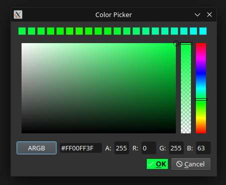

# Simple QT Color Pallete
## Features
- Pick colors from any point of screen.
- ARGB, CMYK, HSL, HSV available.
- Instant recent colors tab for selecting most appropriate shade of color.
---

## Platform Support
- Written using **Qt**, which is cross-platform, but uses **X11** Linux libraries (QtX11Extras) 
  to pick color out of application window.  
- Currently **compiled and tested only on Linux Kubuntu 24.04**.  

---

## Build Instructions
To compile:
```bash
cd ./src    # enter the source directory
qmake       # generate Makefile
make        # build
../colorpicker #run
```

## Screenshots
### Main Window of the compiled app
